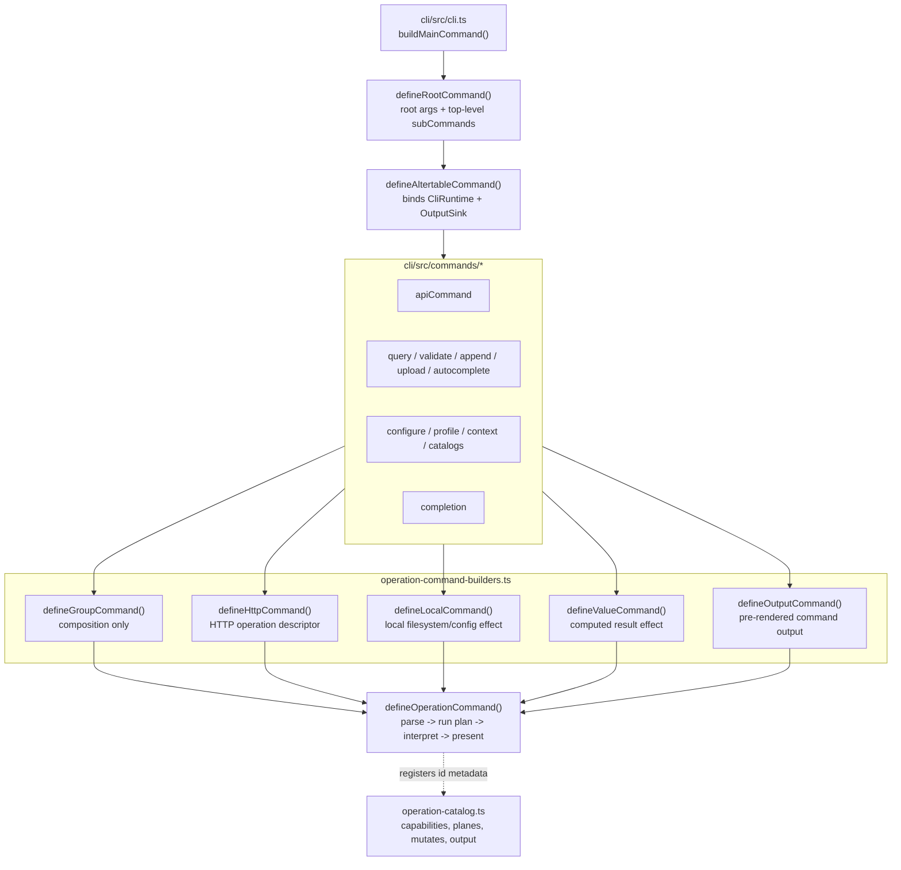
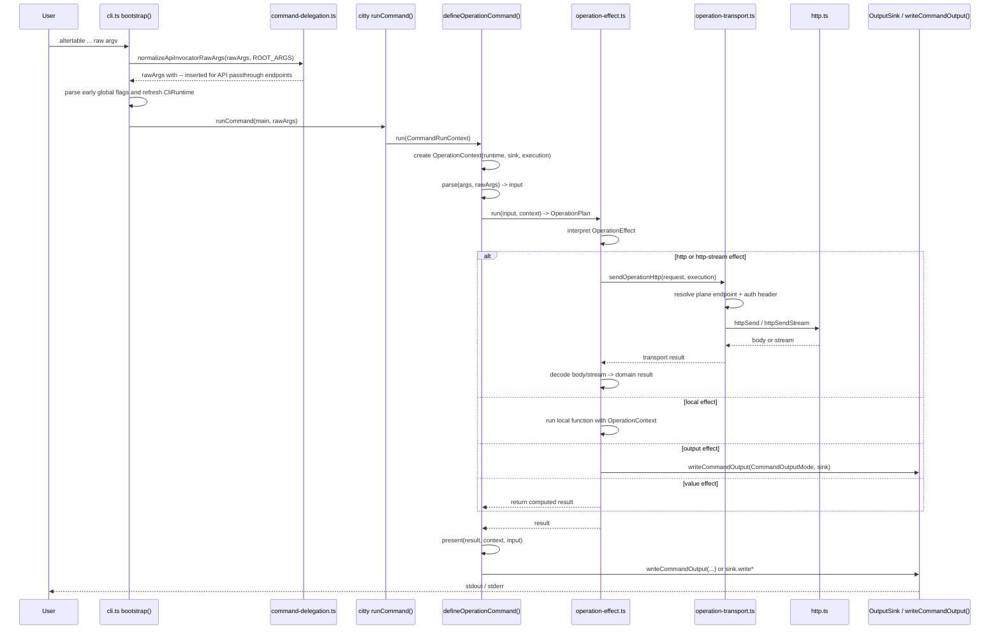
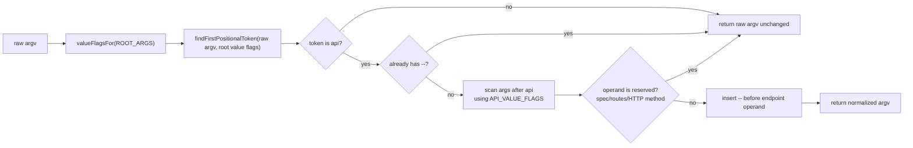

# Command Architecture

This diagram describes the current CLI command architecture and runtime data flow.

## Command Composition

## Runtime Data Flow

## API Delegation Flow

## Naming Boundaries

| Name | Layer | Meaning |
| --- | --- | --- |
| `parse` | command definition | Convert Citty args/raw args into command input data. |
| `run` | operation command core | Build an `OperationPlan`; does not directly own presentation. |
| `operation` | HTTP command builder | Descriptor that turns typed input into HTTP effects. |
| `local` | local command builder | Filesystem/config/local side effect. |
| `value` | effect layer | Already-computed result with no transport or local side effect. |
| `present` | command definition | Convert domain result into command output. |
| `OutputSink` | runtime | Writes stdout/stderr in JSON, raw, human, or metadata channels. |

`defineOutputCommand` currently uses `value` for its public callback even though that callback returns a `CommandOutputMode`. The cleaner public name is `render`; internal `value` effects can stay as the interpreter primitive.
